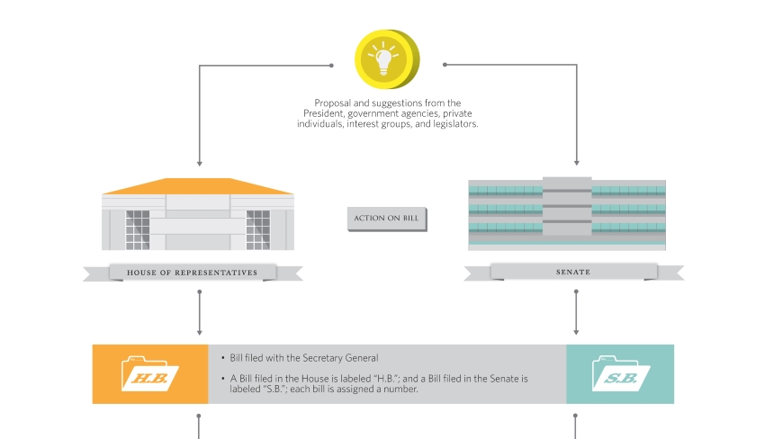
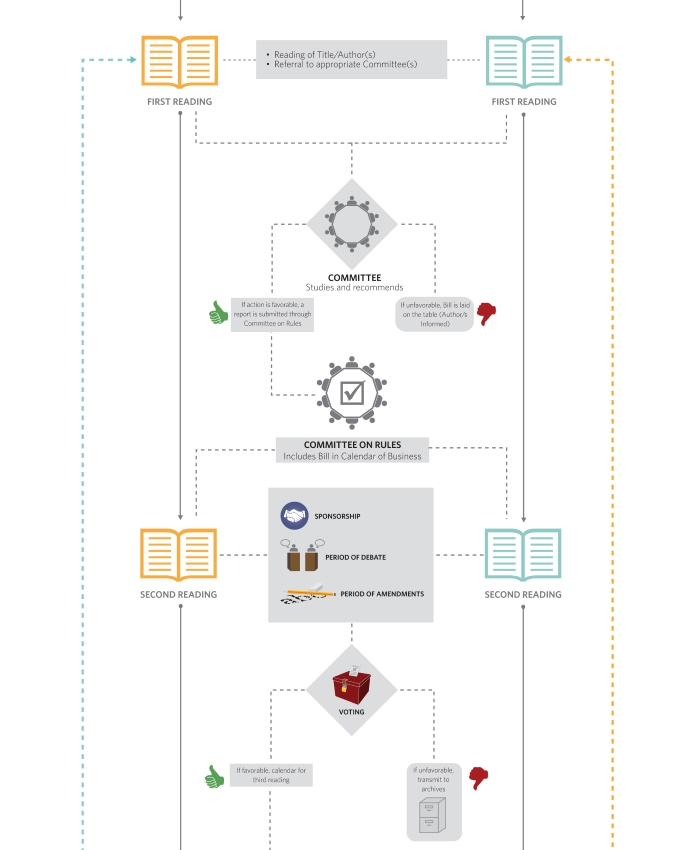
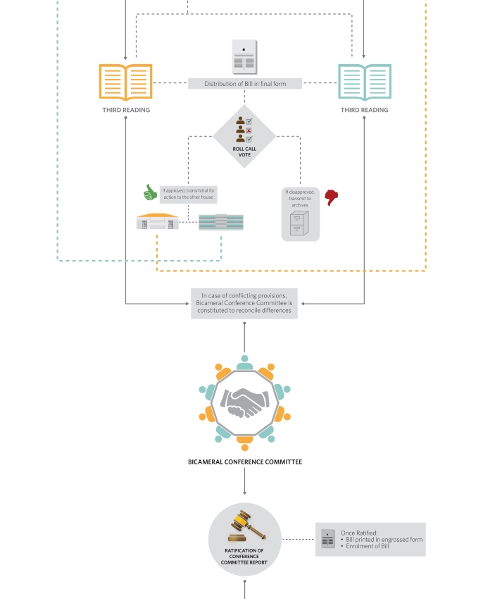

# Kongresmo

Although the Philippine Government has made legislation available through their respective online portals, 
visualizing the progress of a bill remains a challenge. To determine a particular bill's status and timeline, 
it requires the typical Filipino citizen to trawl and plot massive data from:

* [House of Representatives](congress.gov.ph/legisdocs/?v=bills)
* [Senate of the Philippines](https://www.senate.gov.ph/lis/leg_sys.aspx)

*Kongresmo* aims to solve this challenge by providing a one-stop, intuitive app for viewing, and tracking  
legislation authored by the Philippine Senate and House of Representatives.

## Legislative Process

A **bill**, is law in the making. The process, as outlined by the 1987 Constitution, goes along as follows:

## Why

I've always been adamant in pushing the Philippines forward through technology. This project, is a step 
towards a government empowered with effective information dissemination. 

Colleagues have long discouraged me from funneling my efforts in government-related innovations. Almost 
everyone lean on the pessimist side of things - and I can't blame them. Our country is riddled with issues 
of never-ending graft and corruption.

Nevertheless, I stand strong. 🤞

And I also needed an excuse to write in Flutter.

## Running

This project is still under construction 🚧
